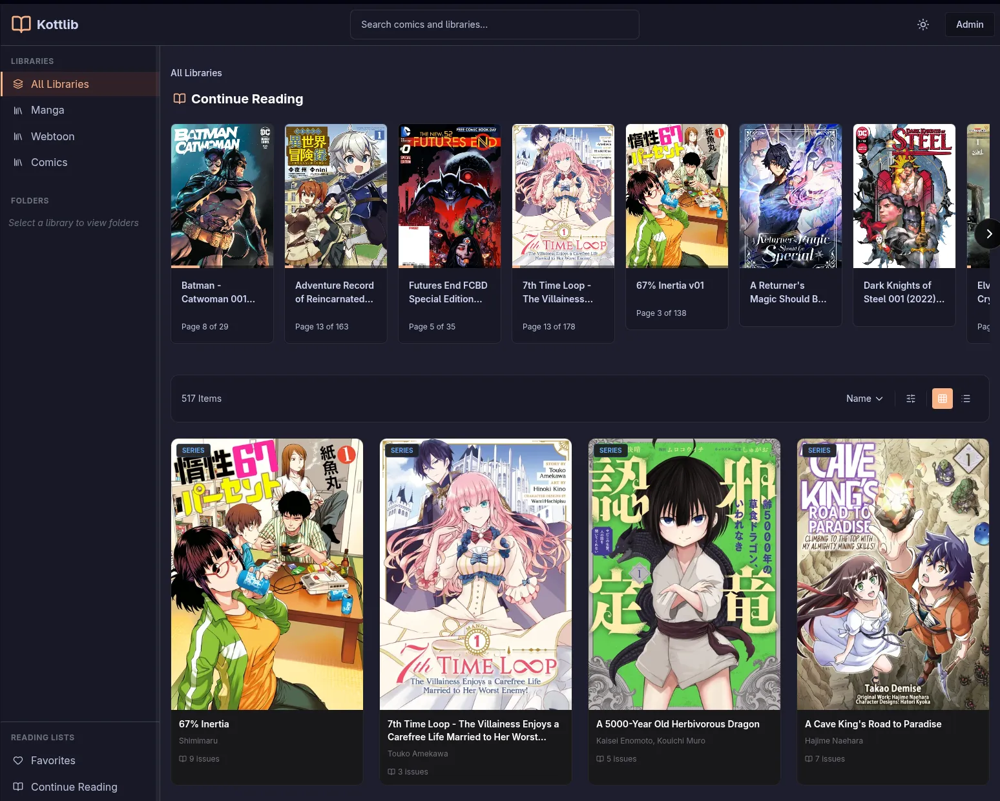
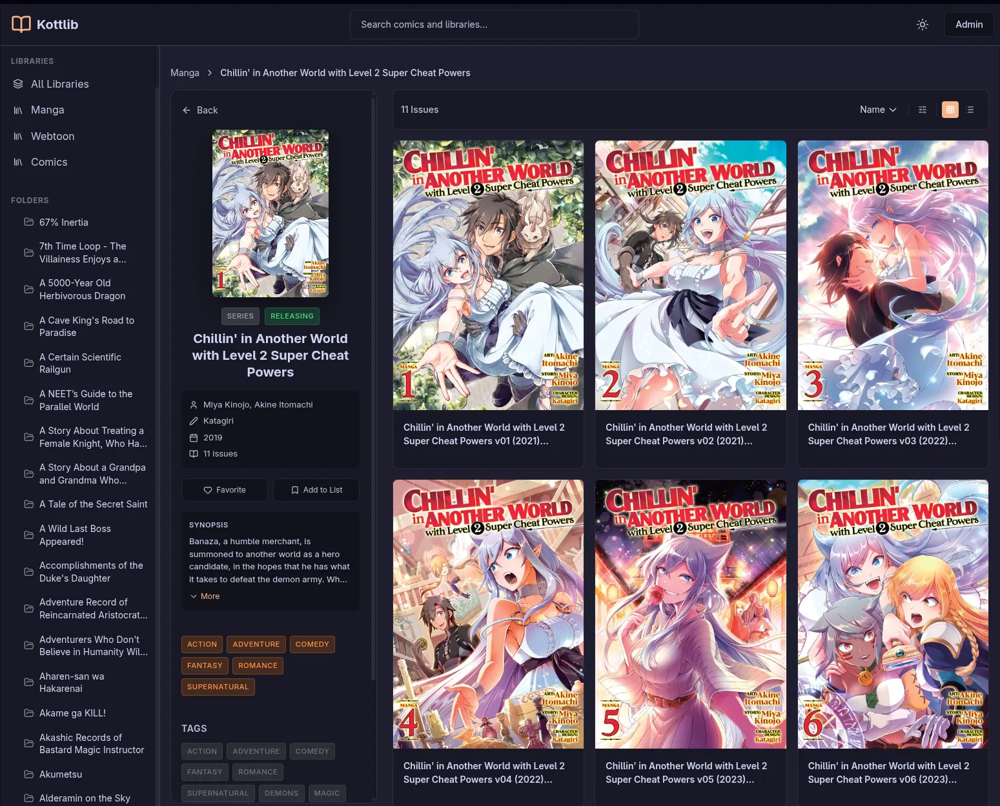

# Kottlib

**Comic library server and webui.**

- Run your own server compatible with YACReader mobile app
- A webreader to access and manage your library in your browser
- Just run `./start.sh`

```bash
git clone https://github.com/kooten111/Kottlib.git
cd Kottlib
./start.sh
```

Done!

- Web UI: <http://localhost:5173>
- API: <http://localhost:8081>
- API Docs: <http://localhost:8081/docs>

---

## What is Kottlib?

A comic reader and library server written in Python that:
- Provides an API and web interface
- Maintains backward compatibility with YACReader mobile apps


## Screenshots

### Gallery View


### Comic Reader


## Features

### Core Features

- **Database Layer** - SQLAlchemy ORM with extended YACReader schema
- **FastAPI Server** - Async API server
- **YACReader API** - Compatible with YACReader mobile apps (v1 & v2)
- **API** - RESTful JSON endpoints with OpenAPI documentation
- **One-Command Setup** - Interactive launcher for easy installation
- **Multi-library Support** - Multiple comic libraries with separate configurations
- **Reading Progress** - Per-user, per-comic progress tracking
- **Continue Reading** - Quick access to in-progress comics
- **Favorites** - Mark comics as favorites


### Web Interface

- **Web UI** - Responsive SvelteKit interface
- **Comic Reader** - Full-featured reader with keyboard shortcuts
- **Library Browser** - Grid/list views with folder navigation
- **Continue Reading** - Track and resume reading progress across devices
- **Favorites** - Mark and manage favorite comics
- **Admin Dashboard** - Server stats and library management

### Metadata Scanner System

- **Pluggable Architecture** - Easy to add new metadata sources
- **Multiple Scanners** - nhentai, AniList, MangaDex, Comic Vine, Metron
- **Smart Matching** - Fuzzy matching with confidence scoring
- **Per-Library Configuration** - Different scanners for different library types
- **Fallback Support** - Automatic fallback to secondary sources
- **API Integration** - RESTful endpoints for scanner management


## Quick Start

### For New Users

```bash
# 1. Clone
git clone https://github.com/kooten111/Kottlib.git
cd Kottlib

# 2. Run
./start.sh
```

The launcher will:
1. Set up virtual environment
2. Install dependencies (if needed)
3. Initialize database
4. Start backend API and web UI

For detailed API documentation, start the server and visit:
- **Interactive API Docs**: <http://localhost:8081/docs> (Swagger UI - test endpoints)
- **API Reference**: <http://localhost:8081/redoc> (ReDoc - beautiful docs)

### After First Run

**Start Everything (Recommended)**

```bash
./start.sh
```

Starts both backend API and Web UI.

**Start Components Separately (for development)**

```bash
# Backend only
./start_backend.sh

# Web UI only (in another terminal, needs backend running)
./start_webui.sh
```

This gives you:
- Backend API on port 8081
- Web UI on port 5173
- Automatic dependency installation and database setup

Your configuration is saved in `config.yml`.

**Run as a systemd Service (Linux)**

For a persistent server that starts on boot, install the included service files:

```bash
sudo cp kottlib-backend.service kottlib-webui.service /etc/systemd/system/
sudo systemctl daemon-reload
sudo systemctl enable kottlib-backend kottlib-webui
sudo systemctl start kottlib-backend kottlib-webui
```

Check status or follow logs:

```bash
sudo systemctl status kottlib-backend kottlib-webui
journalctl -fu kottlib-backend
journalctl -fu kottlib-webui
```

**Other Tools:**
- `./scripts/kottlib-cli.py` - CLI management tool

**Quick Library Scanning:**
```bash
./scan.sh /path/to/library              # Scan with defaults
./scan.sh /path/to/library --workers 8  # Scan with more workers
./scan.sh --help                        # Show all options
```

## Configuration

### Edit Config File

After first run, edit `config.yml` for bootstrap settings:

```yaml
server:
  host: "0.0.0.0"
  port: 8081
  log_level: "info"

database:
  path: null  # null = auto-detect platform default
```

Libraries are managed via the WebUI or API — not in config.yml.

See [docs/CONFIGURATION.md](docs/CONFIGURATION.md) for all available configuration options.

### CLI Tool

For advanced users:

```bash
# Manage config
./scripts/kottlib-cli.py config init
./scripts/kottlib-cli.py config show

# Manage libraries
./scripts/kottlib-cli.py library add "Comics" /mnt/Comics
./scripts/kottlib-cli.py library scan Comics
./scripts/kottlib-cli.py library list

# Server control
./scripts/kottlib-cli.py server start
./scripts/kottlib-cli.py server info
```

## Documentation

**Live API Documentation** (when server is running):
- <http://localhost:8081/docs> - Interactive Swagger UI
- <http://localhost:8081/redoc> - ReDoc API reference
- <http://localhost:8081/openapi.json> - OpenAPI schema

**Project Documentation:**
- [docs/API.md](docs/API.md) - Complete API reference
- [docs/ARCHITECTURE.md](docs/ARCHITECTURE.md) - System architecture
- [docs/SCANNERS.md](docs/SCANNERS.md) - Scanner system documentation
- [docs/SERVICES.md](docs/SERVICES.md) - Service layer guide
- [docs/SEARCH.md](docs/SEARCH.md) - Search functionality guide
- [docs/CONFIGURATION.md](docs/CONFIGURATION.md) - Configuration options and reference

## Project Structure

```text
Kottlib/
├── start.sh               # Start everything (backend + web UI)
├── start_backend.sh       # Start backend API only
├── start_webui.sh         # Start web UI only
├── scan.sh                # Library scanner
├── config.yml             # Your config (created on first run)
├── src/
│   ├── api/               # FastAPI server
│   │   ├── main.py        # Application entry point
│   │   ├── middleware/    # Session & CORS middleware
│   │   └── routers/       # API route handlers
│   │       ├── legacy_v1.py      # YACReader v1 API (text format)
│   │       ├── app_api/          # Kottlib-native API namespace (/api/*)
│   │       ├── covers.py         # Cover serving endpoints
│   │       ├── user_interactions.py  # Favorites, progress
│   │       ├── scanners/         # Metadata scanner API (package)
│   │       │   ├── router.py, manager.py, models.py
│   │       │   ├── endpoints/    # Individual endpoint modules
│   │       │   └── tasks/        # Background scan tasks
│   │       └── v2/               # YACReader v2 API (JSON format)
│   │           ├── comics.py, collections.py, folders.py
│   │           ├── libraries.py, reading.py, search.py
│   │           ├── series.py, session.py, covers.py
│   │           ├── admin.py, tree.py
│   │           └── _browse_helpers.py, _item_builders.py, _shared.py
│   ├── database/          # Database layer
│   │   ├── models/        # SQLAlchemy models (modular)
│   │   ├── operations/    # CRUD operations
│   │   ├── paths.py       # Path utilities
│   │   └── connection.py  # Database connection
│   ├── scanner/           # Core scanner engine
│   │   ├── loaders/       # Format-specific loaders (CBZ/CBR/CB7)
│   │   ├── comic_loader.py        # Archive factory
│   │   ├── comic_processor.py     # Comic processing
│   │   ├── thumbnail_generator.py # JPEG + WebP thumbnails
│   │   └── threaded_scanner.py    # Multi-threaded scanner
│   ├── metadata_providers/ # Metadata scanner framework
│   │   ├── base.py                # Scanner interface (BaseScanner)
│   │   ├── manager.py             # Scanner registry & discovery
│   │   ├── schema.py              # Field mapping
│   │   ├── config.py              # Configuration options
│   │   ├── utils.py               # Utilities
│   │   └── demo.py                # Demo scanner
│   ├── services/          # Business logic layer
│   │   ├── metadata_service.py    # Metadata application
│   │   ├── cover_service.py       # Cover generation/retrieval
│   │   ├── comic_info_service.py  # Shared V1/V2 comic info
│   │   ├── library_service.py     # Library management
│   │   ├── library_cache.py       # Browse response caching
│   │   ├── scan_service.py        # Scan orchestration
│   │   ├── search_service.py      # FTS and advanced search
│   │   ├── reading_service.py     # Progress, favorites, labels
│   │   ├── config_sync.py         # Config file ↔ database sync
│   │   ├── scheduler.py           # APScheduler integration
│   │   └── mangadex_client.py     # MangaDex API client
│   ├── client/            # Python client library
│   │   └── kottlib.py     # API client for programmatic access
│   ├── utils/             # Utilities
│   │   ├── errors.py      # Error types
│   │   ├── hashing.py     # Hash functions
│   │   ├── pagination.py  # Pagination helpers
│   │   ├── platform.py    # Platform-specific paths
│   │   ├── series_utils.py # Series detection
│   │   └── sorting.py     # Natural sort
│   └── config.py          # Configuration management
├── scanners/              # Scanner plugins (auto-discovered)
│   ├── AniList/           # AniList scanner plugin
│   ├── ComicVine/         # Comic Vine scanner plugin
│   ├── mangadex/          # MangaDex scanner plugin
│   ├── metron/            # Metron scanner plugin
│   └── nhentai/           # nhentai scanner plugin
├── webui/                 # SvelteKit frontend
│   ├── src/
│   │   ├── routes/        # Page routes
│   │   │   ├── admin/             # Admin dashboard
│   │   │   ├── browse/            # Global browse
│   │   │   ├── comic/[libraryId]/[comicId]/  # Comic detail & reader
│   │   │   ├── library/[libraryId]/browse/   # Library browser
│   │   │   ├── reading-lists/     # Reading lists and items
│   │   │   ├── continue-reading/  # Continue reading list
│   │   │   ├── favorites/         # Favorites
│   │   │   └── search/            # Search interface
│   │   ├── lib/           # Reusable components & stores
│   │   │   ├── api/               # API client modules
│   │   │   ├── components/        # Reusable UI components
│   │   │   ├── stores/            # Svelte stores
│   │   │   ├── themes/            # 16 built-in themes
│   │   │   ├── actions/           # Svelte actions
│   │   │   ├── server/            # Server-side utilities
│   │   │   └── utils/             # Helper functions
│   │   └── app.html       # HTML template
│   ├── package.json       # Bun dependencies
│   └── vite.config.js     # Vite configuration
├── scripts/               # Utility scripts
│   ├── kottlib-cli.py     # CLI management tool
│   ├── scan_library.py    # Library scanning
│   ├── diagnose_missing_data.py   # Debug tools
│   └── regenerate_covers.py       # Cover regeneration
├── tests/                 # Test suite
│   ├── conftest.py        # Test fixtures
│   └── api/               # API tests
│       ├── test_v1_api.py
│       ├── test_v2_api.py
│       └── test_integration.py
├── docs/                  # Documentation
│   ├── API.md                 # Complete API reference
│   ├── ARCHITECTURE.md        # System architecture
│   ├── SCANNERS.md            # Scanner system guide
│   ├── SERVICES.md            # Service layer documentation
│   └── SEARCH.md              # Search functionality guide
└── data/                  # Runtime data (created on first run, gitignored)
    ├── main.db            # SQLite database
    └── covers/            # Generated thumbnails (JPEG + WebP)
        └── <LibraryName>/ # Per-library cover storage
```

## Requirements

- Python 3.11+
- Bun (for web UI) - https://bun.sh

### System Dependencies (for CBR support)

- **unrar** - Required for reading CBR (RAR) archives
  - Arch Linux: `sudo pacman -S unrar`
  - Debian/Ubuntu: `sudo apt install unrar`
  - macOS: `brew install unrar`

The launcher installs all Python dependencies automatically.

## License

MIT License - See LICENSE file for details.

## Acknowledgments

- [YACReader](https://www.yacreader.com/) - Original comic reader and server
- Built by reverse-engineering the YACReaderLibrary Server protocol

## Related Projects

- [YACReader](https://github.com/YACReader/yacreader) - Original desktop & server
- [YACReader iOS](https://apps.apple.com/app/yacreader/id635717885) - Official iOS app
- [YACReader Android](https://play.google.com/store/apps/details?id=com.yacreader.yacreader) - Official Android app

---

Get started:

```bash
./start.sh
```
