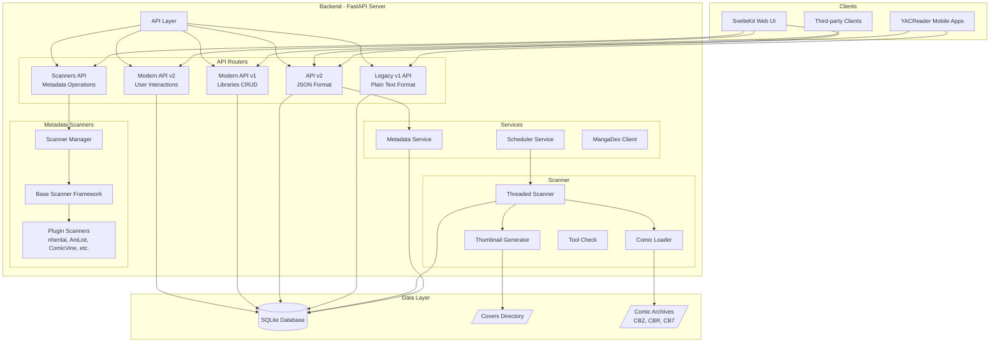
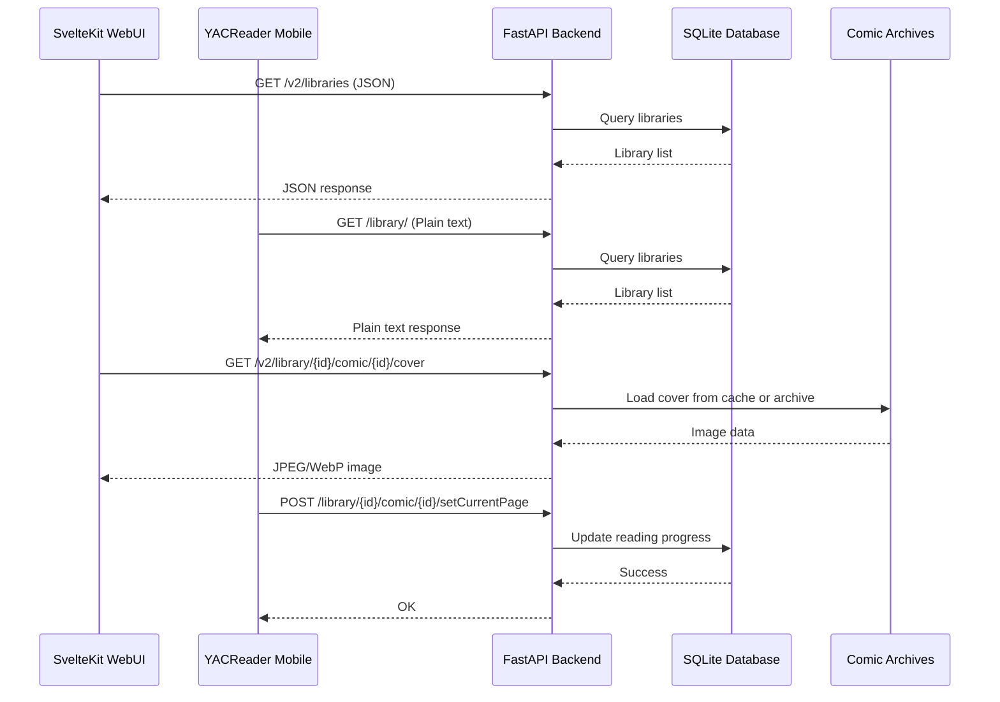
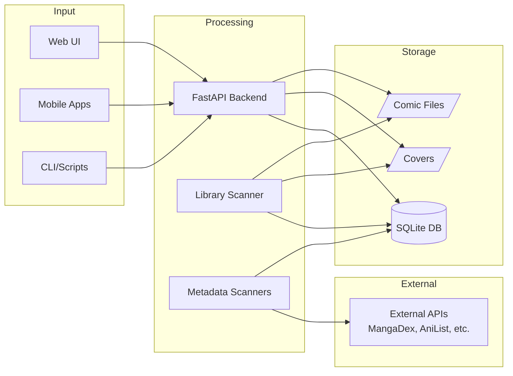

# Kottlib (YACLib Enhanced) - Architecture Documentation

## Overview

Kottlib (YACLib Enhanced) is a modern comic library server with full backward compatibility with YACReader mobile apps. It provides a FastAPI backend, SQLite database, and SvelteKit web frontend for managing and reading comic collections.

## System Architecture Diagram



## Component Relationships

### Frontend ↔ Backend Communication



## Technology Stack

### Backend
| Component | Technology | Version | Purpose |
|-----------|------------|---------|---------|
| Web Framework | FastAPI | 0.104+ | Async REST API with automatic OpenAPI docs |
| Database ORM | SQLAlchemy | 2.0+ | Database abstraction with type hints |
| Database | SQLite | 3.x | Lightweight embedded database |
| Task Scheduler | APScheduler | 3.x | Background job scheduling for library scans |
| Image Processing | Pillow | 10.x | Thumbnail generation and image manipulation |
| Archive Handling | zipfile, rarfile, py7zr | stdlib/3rd party | Comic archive extraction |
| HTTP Client | requests | 2.x | External API calls (MangaDex, metadata scanners) |
| YAML Parser | PyYAML | 6.x | Configuration file parsing |

### Frontend
| Component | Technology | Version | Purpose |
|-----------|------------|---------|---------|
| Framework | SvelteKit | 2.x | Modern SSR-capable frontend |
| Styling | TailwindCSS | 3.x | Utility-first CSS framework |
| State Management | Svelte Stores | native | Reactive state management |
| Data Fetching | TanStack Query | 5.x | Server state caching (15min stale, 30min cache) |
| Build Tool | Vite | 5.x | Fast development and production builds |

### External APIs
| Service | Purpose | Rate Limit |
|---------|---------|------------|
| MangaDex | Cover art, manga metadata | 5 req/sec |
| nhentai | Doujinshi metadata | Variable |
| AniList | Anime/manga metadata (GraphQL) | 90 req/min |
| Comic Vine | Western comics metadata | Requires API key |
| Metron | Comics database | Requires credentials |

## Data Flow Overview



## Directory Structure

```
Kottlib/
├── src/                          # Backend source code
│   ├── api/                      # FastAPI application
│   │   ├── main.py              # Application entry point
│   │   ├── middleware/          # Request middleware (session, CORS)
│   │   └── routers/             # API endpoint definitions
│   │       ├── legacy_v1.py     # YACReader v1 compatible API
│   │       ├── scanners.py      # Metadata scanner endpoints
│   │       ├── libraries.py     # Modern library CRUD
│   │       ├── user_interactions.py  # Favorites, progress
│   │       ├── config.py        # Server configuration API
│   │       └── v2/              # JSON-format v2 API
│   │           ├── libraries.py
│   │           ├── folders.py
│   │           ├── comics.py
│   │           ├── reading.py
│   │           ├── search.py
│   │           ├── series.py
│   │           ├── covers.py
│   │           ├── collections.py
│   │           ├── session.py
│   │           └── admin.py
│   ├── database/                # Database layer
│   │   ├── models.py           # SQLAlchemy ORM models (14 tables)
│   │   ├── database.py         # Database connection and utilities
│   │   ├── enhanced_search.py  # FTS search implementation
│   │   └── migrations/         # Database migration scripts
│   ├── scanner/                 # Library scanning
│   │   ├── comic_loader.py     # Archive extraction (CBZ/CBR/CB7)
│   │   ├── threaded_scanner.py # Multi-threaded scanner
│   │   ├── thumbnail_generator.py # Cover generation
│   │   └── tool_check.py       # External tool verification
│   ├── scanners/                # Metadata scanner framework
│   │   ├── base_scanner.py     # Abstract scanner interface
│   │   ├── scanner_manager.py  # Scanner registry and discovery
│   │   ├── config_schema.py    # Configuration option definitions
│   │   └── metadata_schema.py  # Field mapping definitions
│   ├── services/                # Business logic services
│   │   ├── metadata_service.py # Apply scanner results to comics
│   │   ├── scheduler.py        # APScheduler integration
│   │   └── mangadex_client.py  # MangaDex API client
│   ├── covers/                  # Cover provider framework
│   │   └── base_provider.py    # Abstract cover provider
│   ├── config.py               # Configuration management
│   └── init_db.py              # Database initialization script
├── scanners/                    # Plugin metadata scanners
│   ├── nhentai/
│   │   └── nhentai_scanner.py
│   ├── AniList/
│   │   └── anilist_scanner.py
│   ├── ComicVine/
│   │   └── comic_vine_scanner.py
│   ├── mangadex/
│   │   └── mangadex_scanner.py
│   └── metron/
│       └── metron_scanner.py
├── webui/                       # SvelteKit frontend
│   ├── src/
│   │   ├── routes/             # Page routes
│   │   │   ├── +page.svelte    # Home/Library browser
│   │   │   ├── admin/          # Admin dashboard
│   │   │   ├── comic/          # Comic reader
│   │   │   ├── series/         # Series browser
│   │   │   ├── search/         # Search interface
│   │   │   ├── favorites/      # User favorites
│   │   │   └── continue-reading/
│   │   └── lib/
│   │       ├── api/            # API client modules
│   │       ├── components/     # Reusable UI components
│   │       ├── stores/         # Svelte stores
│   │       └── utils/          # Helper functions
│   ├── static/                 # Static assets
│   └── package.json
├── tests/                       # Test suite
├── docs/                        # Documentation
├── scripts/                     # Utility scripts
├── config.example.yml          # Example configuration
├── requirements.txt            # Python dependencies
├── start.sh                    # Full stack startup script
├── start_backend.sh            # Backend only startup
└── start_webui.sh              # Frontend only startup
```

## Key Design Decisions

### 1. Multi-API Architecture
The server exposes multiple API formats to support different clients:
- **Legacy v1**: Plain text format for YACReader mobile apps backward compatibility
- **API v2**: JSON format for enhanced YACReader features
- **Modern API**: RESTful JSON for web UI and third-party integrations

### 2. Pluggable Scanner System
Metadata scanners are discovered dynamically from the `scanners/` directory:
- Each scanner extends `BaseScanner`
- Scanners define their own configuration schemas
- ScannerManager handles registration and instantiation

### 3. Per-Library Database
While there's a main database for configuration, each library can have its own data:
- Enables library-specific settings
- Supports distributed/federated setups

### 4. Dual Thumbnail Format
Covers are generated in both JPEG and WebP:
- JPEG (300px) for mobile app compatibility
- WebP (400px) for web UI efficiency

### 5. Cached Series Tree
Library folder structures are pre-computed during scans:
- Stored as JSON in `library.cached_series_tree`
- Eliminates N+1 queries on page load
- Refreshed on each library scan
