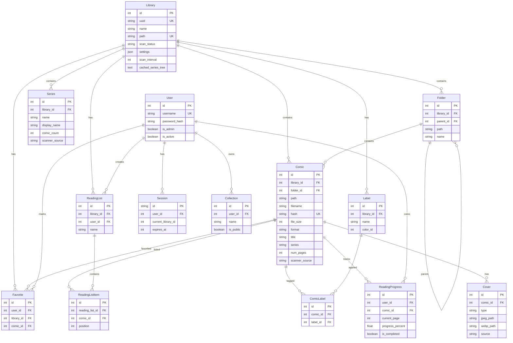

# Database Documentation

## Overview

Kottlib uses SQLite as its primary database with SQLAlchemy 2.0 ORM for data access. The schema supports comic library management with full YACReader compatibility.

## Database Location

The database location follows platform conventions:
- **Linux**: `~/.local/share/yaclib/yaclib.db`
- **macOS**: `~/Library/Application Support/Kottlib/yaclib.db`
- **Windows**: `%LOCALAPPDATA%/Kottlib/yaclib.db`

Can be overridden via:
- Environment variable: `KOTTLIB_DB_PATH`
- Config file: `database.path`

## ORM Models

### 1. Library

Primary table for comic library definitions.

| Field | Type | Required | Default | Description |
|-------|------|----------|---------|-------------|
| `id` | Integer | PK | auto | Primary key |
| `uuid` | String | Yes | - | Unique identifier (UUID format) |
| `name` | String | Yes | - | Display name |
| `path` | String | Yes | - | Filesystem path (unique) |
| `created_at` | Integer | Yes | - | Unix timestamp |
| `updated_at` | Integer | Yes | - | Unix timestamp |
| `scan_status` | String | No | 'pending' | Current scan state: pending, scanning, idle, error |
| `last_scan_started` | Integer | No | null | Unix timestamp of last scan start |
| `last_scan_completed` | Integer | No | null | Unix timestamp of last scan completion |
| `scanner_type` | String | No | 'comic' | Library type identifier |
| `settings` | JSON | No | null | Library-specific settings (scanner config, etc.) |
| `scan_interval` | Integer | No | 0 | Auto-scan interval in minutes (0 = disabled) |
| `cached_series_tree` | Text | No | null | Pre-built folder/comic tree as JSON |
| `tree_cache_updated_at` | Integer | No | null | When tree cache was last updated |

**Relationships:**
- `folders`: One-to-Many → Folder (cascade delete)
- `comics`: One-to-Many → Comic (cascade delete)
- `series`: One-to-Many → Series (cascade delete)

---

### 2. Folder

Hierarchical folder structure within libraries.

| Field | Type | Required | Default | Description |
|-------|------|----------|---------|-------------|
| `id` | Integer | PK | auto | Primary key |
| `library_id` | Integer | FK | null | References libraries.id (nullable for library-specific DBs) |
| `parent_id` | Integer | FK | null | References folders.id (self-reference) |
| `path` | String | Yes | - | Full filesystem path |
| `name` | String | Yes | - | Folder display name |
| `first_child_hash` | String | No | null | Hash of first child comic (for cover) |
| `position` | Integer | No | 0 | Sort order position |
| `created_at` | Integer | Yes | - | Unix timestamp |
| `updated_at` | Integer | Yes | - | Unix timestamp |

**Indexes:**
- `idx_folders_library`: library_id
- `idx_folders_parent`: parent_id
- `idx_folders_library_path`: (library_id, path)
- `idx_folders_name`: name

**Constraints:**
- `UniqueConstraint('library_id', 'path')`

**Relationships:**
- `library`: Many-to-One → Library
- `parent`: Many-to-One → Folder (self-referential)
- `children`: One-to-Many → Folder (cascade delete)
- `comics`: One-to-Many → Comic

---

### 3. Comic

Main table for comic metadata with 50+ fields.

| Field | Type | Required | Default | Description |
|-------|------|----------|---------|-------------|
| **Identity** |
| `id` | Integer | PK | auto | Primary key |
| `library_id` | Integer | FK | null | References libraries.id |
| `folder_id` | Integer | FK | null | References folders.id (SET NULL on delete) |
| `path` | String | Yes | - | Full filesystem path |
| `filename` | String | Yes | - | File name |
| `hash` | String | Yes | - | YACReader-compatible hash (unique) |
| **File Metadata** |
| `file_size` | Integer | Yes | - | Size in bytes |
| `file_modified_at` | Integer | Yes | - | File mtime as Unix timestamp |
| `format` | String | Yes | - | Archive format: cbz, cbr, cb7 |
| **Basic Metadata** |
| `title` | String | No | null | Comic title |
| `series` | String | No | null | Series name |
| `volume` | Integer | No | null | Volume number |
| `issue_number` | Float | No | null | Issue number (float for decimals like 1.5) |
| `year` | Integer | No | null | Publication year |
| `publisher` | String | No | null | Publisher name |
| `writer` | String | No | null | Writer(s) |
| `artist` | String | No | null | Artist(s) |
| `description` | Text | No | null | Synopsis/description |
| **Extended ComicInfo.xml Metadata** |
| `penciller` | String | No | null | Penciller(s) |
| `inker` | String | No | null | Inker(s) |
| `colorist` | String | No | null | Colorist(s) |
| `letterer` | String | No | null | Letterer(s) |
| `cover_artist` | String | No | null | Cover artist(s) |
| `editor` | String | No | null | Editor(s) |
| **Series/Arc Metadata** |
| `story_arc` | String | No | null | Story arc name |
| `arc_number` | String | No | null | Position in story arc |
| `arc_count` | Integer | No | null | Total issues in arc |
| `alternate_series` | String | No | null | Alternate series name |
| `alternate_number` | String | No | null | Alternate issue number |
| `alternate_count` | Integer | No | null | Total in alternate series |
| **Additional Metadata** |
| `genre` | String | No | null | Genre(s), comma-separated |
| `language_iso` | String | No | null | ISO language code |
| `age_rating` | String | No | null | Age rating (G, PG, etc.) |
| `imprint` | String | No | null | Publisher imprint |
| `format_type` | String | No | null | Comic format (not file format) |
| `is_color` | Boolean | No | null | True if color comic |
| **Characters & Locations** |
| `characters` | Text | No | null | Character names |
| `teams` | Text | No | null | Team names |
| `locations` | Text | No | null | Location names |
| `main_character_or_team` | String | No | null | Primary character/team |
| `series_group` | String | No | null | Series grouping for franchises |
| **User Content** |
| `notes` | Text | No | null | User notes |
| `review` | Text | No | null | User review |
| `tags` | Text | No | null | User tags |
| **External IDs** |
| `comic_vine_id` | String | No | null | Comic Vine ID |
| `web` | String | No | null | Web URL / source URL |
| `metadata_json` | Text | No | null | Flexible metadata as JSON |
| **Scanner Metadata** |
| `scanner_source` | String | No | null | Scanner name that provided metadata |
| `scanner_source_id` | String | No | null | External source ID |
| `scanner_source_url` | String | No | null | External source URL |
| `scanned_at` | Integer | No | null | When metadata was scanned |
| `scan_confidence` | Float | No | null | Confidence score 0.0-1.0 |
| **Issue Metadata** |
| `is_bis` | Boolean | No | false | Special issue flag |
| `count` | Integer | No | null | Total issue count in series |
| `date` | String | No | null | Publication date (YYYY-MM or YYYY-MM-DD) |
| **Reading Metadata** |
| `num_pages` | Integer | Yes | - | Total page count |
| `reading_direction` | String | No | 'ltr' | ltr or rtl |
| **Display Settings** |
| `rating` | Float | No | 0.0 | User rating |
| `brightness` | Integer | No | 0 | Display brightness adjustment |
| `contrast` | Integer | No | 0 | Display contrast adjustment |
| `gamma` | Float | No | 1.0 | Display gamma adjustment |
| **Bookmarks** |
| `bookmark1` | Integer | No | 0 | First bookmark page |
| `bookmark2` | Integer | No | 0 | Second bookmark page |
| `bookmark3` | Integer | No | 0 | Third bookmark page |
| **Cover Info** |
| `cover_page` | Integer | No | 1 | Cover page number |
| `cover_size_ratio` | Float | No | 0.0 | Width/height ratio |
| `original_cover_size` | String | No | null | Original dimensions (e.g., "800x1200") |
| **Access Tracking** |
| `last_time_opened` | Integer | No | null | Last opened timestamp |
| `has_been_opened` | Boolean | No | false | Whether comic has been opened |
| `edited` | Boolean | No | false | Whether metadata was manually edited |
| **Status** |
| `position` | Integer | No | 0 | Sort position |
| `created_at` | Integer | Yes | - | Unix timestamp |
| `updated_at` | Integer | Yes | - | Unix timestamp |

**Indexes (33 total):**
```
idx_comics_library, idx_comics_folder, idx_comics_hash, idx_comics_series,
idx_comics_title, idx_comics_publisher, idx_comics_year, idx_comics_filename,
idx_comics_library_series, idx_comics_library_folder, idx_comics_file_modified,
idx_comics_library_count, idx_comics_writer, idx_comics_artist,
idx_comics_penciller, idx_comics_inker, idx_comics_colorist, idx_comics_letterer,
idx_comics_cover_artist, idx_comics_editor, idx_comics_genre,
idx_comics_scanner_source, idx_comics_story_arc, idx_comics_language,
idx_comics_age_rating, idx_comics_library_writer, idx_comics_library_artist,
idx_comics_library_genre, idx_comics_library_publisher, idx_comics_library_year
```

**Relationships:**
- `library`: Many-to-One → Library
- `folder`: Many-to-One → Folder
- `covers`: One-to-Many → Cover (cascade delete)
- `reading_progress`: One-to-Many → ReadingProgress (cascade delete)

---

### 4. Cover

Generated thumbnail storage.

| Field | Type | Required | Default | Description |
|-------|------|----------|---------|-------------|
| `id` | Integer | PK | auto | Primary key |
| `comic_id` | Integer | FK | Yes | References comics.id (cascade delete) |
| `type` | String | Yes | - | Cover type: auto, custom |
| `page_number` | Integer | Yes | - | Source page number |
| `jpeg_path` | String | Yes | - | Path to JPEG thumbnail |
| `webp_path` | String | No | null | Path to WebP thumbnail |
| `generated_at` | Integer | Yes | - | Generation timestamp |
| `source` | String | Yes | 'archive' | Source: archive, mangadex, upload |
| `source_url` | String | No | null | Original URL for external covers |

**Indexes:**
- `idx_covers_comic`: comic_id

**Constraints:**
- `UniqueConstraint('comic_id', 'type')`

**Relationships:**
- `comic`: Many-to-One → Comic

---

### 5. Series

Aggregated series metadata.

| Field | Type | Required | Default | Description |
|-------|------|----------|---------|-------------|
| `id` | Integer | PK | auto | Primary key |
| `library_id` | Integer | FK | Yes | References libraries.id (cascade delete) |
| `name` | String | Yes | - | Series name (unique per library) |
| `display_name` | String | No | null | Display name (can differ from name) |
| `publisher` | String | No | null | Publisher |
| `year_start` | Integer | No | null | First publication year |
| `year_end` | Integer | No | null | Last publication year |
| `description` | Text | No | null | Series description |
| `comic_count` | Integer | No | 0 | Number of comics |
| `total_issues` | Integer | No | 0 | Total expected issues |
| `scanner_source` | String | No | null | Metadata source scanner |
| `scanner_source_id` | String | No | null | External source ID |
| `scanner_source_url` | String | No | null | External source URL |
| `scanned_at` | Integer | No | null | When scanned |
| `scan_confidence` | Float | No | null | Confidence score |
| `writer` | String | No | null | Primary writer(s) |
| `artist` | String | No | null | Primary artist(s) |
| `genre` | String | No | null | Genre(s) |
| `tags` | Text | No | null | Tags |
| `status` | String | No | null | Status: ongoing, completed, etc. |
| `format` | String | No | null | Series format |
| `chapters` | Integer | No | null | Chapter count |
| `volumes` | Integer | No | null | Volume count |
| `created_at` | Integer | Yes | - | Unix timestamp |
| `updated_at` | Integer | Yes | - | Unix timestamp |

**Indexes (16 total):**
```
idx_series_library, idx_series_name, idx_series_library_name, idx_series_year_start,
idx_series_writer, idx_series_artist, idx_series_genre, idx_series_publisher,
idx_series_status, idx_series_scanner_source, idx_series_library_writer,
idx_series_library_artist, idx_series_library_genre, idx_series_library_publisher
```

**Constraints:**
- `UniqueConstraint('library_id', 'name')`

**Relationships:**
- `library`: Many-to-One → Library

---

### 6. User

User accounts for reading progress and preferences.

| Field | Type | Required | Default | Description |
|-------|------|----------|---------|-------------|
| `id` | Integer | PK | auto | Primary key |
| `username` | String | Yes | - | Unique username |
| `password_hash` | String | Yes | - | Hashed password |
| `email` | String | No | null | Email address |
| `is_admin` | Boolean | No | false | Admin privileges |
| `is_active` | Boolean | No | true | Account active status |
| `created_at` | Integer | Yes | - | Unix timestamp |
| `last_login_at` | Integer | No | null | Last login timestamp |

**Indexes:**
- `idx_users_username`: username

**Relationships:**
- `reading_progress`: One-to-Many → ReadingProgress (cascade delete)
- `sessions`: One-to-Many → Session (cascade delete)
- `collections`: One-to-Many → Collection (cascade delete)

---

### 7. Session

User session management for mobile apps.

| Field | Type | Required | Default | Description |
|-------|------|----------|---------|-------------|
| `id` | String | PK | - | Session UUID |
| `user_id` | Integer | FK | Yes | References users.id (cascade delete) |
| `current_library_id` | Integer | No | null | Currently selected library |
| `current_comic_id` | Integer | No | null | Currently reading comic |
| `device_type` | String | No | null | Device: ipad, android, tablet |
| `display_type` | String | No | null | Display scale: @1x, @2x, @3x |
| `downloaded_comics` | Text | No | null | Tab-separated hashes |
| `user_agent` | String | No | null | Client user agent |
| `ip_address` | String | No | null | Client IP address |
| `created_at` | Integer | Yes | - | Unix timestamp |
| `last_activity_at` | Integer | Yes | - | Last activity timestamp |
| `expires_at` | Integer | Yes | - | Session expiration |

**Indexes:**
- `idx_sessions_user`: user_id
- `idx_sessions_expires`: expires_at

**Relationships:**
- `user`: Many-to-One → User

---

### 8. ReadingProgress

Per-user reading progress tracking.

| Field | Type | Required | Default | Description |
|-------|------|----------|---------|-------------|
| `id` | Integer | PK | auto | Primary key |
| `user_id` | Integer | FK | Yes | References users.id (cascade delete) |
| `comic_id` | Integer | FK | Yes | References comics.id (cascade delete) |
| `current_page` | Integer | No | 0 | Current reading page |
| `total_pages` | Integer | Yes | - | Total pages in comic |
| `progress_percent` | Float | No | 0.0 | Percentage complete |
| `is_completed` | Boolean | No | false | Reading completed flag |
| `started_at` | Integer | Yes | - | When reading started |
| `last_read_at` | Integer | Yes | - | Last read timestamp |
| `completed_at` | Integer | No | null | When completed |

**Indexes:**
```
idx_reading_progress_user, idx_reading_progress_comic, idx_reading_progress_last_read,
idx_reading_progress_continue (user_id, is_completed, last_read_at),
idx_reading_progress_completed (user_id, is_completed, completed_at),
idx_reading_progress_percent
```

**Constraints:**
- `UniqueConstraint('user_id', 'comic_id')`

**Relationships:**
- `user`: Many-to-One → User
- `comic`: Many-to-One → Comic

---

### 9. Collection

User-defined comic collections.

| Field | Type | Required | Default | Description |
|-------|------|----------|---------|-------------|
| `id` | Integer | PK | auto | Primary key |
| `user_id` | Integer | FK | Yes | References users.id (cascade delete) |
| `name` | String | Yes | - | Collection name |
| `description` | Text | No | null | Description |
| `is_public` | Boolean | No | false | Public visibility |
| `position` | Integer | No | 0 | Sort order |
| `created_at` | Integer | Yes | - | Unix timestamp |
| `updated_at` | Integer | Yes | - | Unix timestamp |

**Indexes:**
- `idx_collections_user`: user_id
- `idx_collections_user_position`: (user_id, position)

**Relationships:**
- `user`: Many-to-One → User

---

### 10. Favorite

User favorites (YACReader compatibility).

| Field | Type | Required | Default | Description |
|-------|------|----------|---------|-------------|
| `id` | Integer | PK | auto | Primary key |
| `user_id` | Integer | FK | Yes | References users.id (cascade delete) |
| `library_id` | Integer | FK | Yes | References libraries.id (cascade delete) |
| `comic_id` | Integer | FK | Yes | References comics.id (cascade delete) |
| `created_at` | Integer | Yes | - | Unix timestamp |

**Indexes:**
```
idx_favorites_user, idx_favorites_library, idx_favorites_comic,
idx_favorites_user_created (user_id, created_at)
```

**Constraints:**
- `UniqueConstraint('user_id', 'comic_id')`

---

### 11. Label

Custom labels/tags for comics.

| Field | Type | Required | Default | Description |
|-------|------|----------|---------|-------------|
| `id` | Integer | PK | auto | Primary key |
| `library_id` | Integer | FK | Yes | References libraries.id (cascade delete) |
| `name` | String | Yes | - | Label name |
| `color_id` | Integer | No | 0 | Color identifier for UI |
| `position` | Integer | No | 0 | Sort order |
| `created_at` | Integer | Yes | - | Unix timestamp |
| `updated_at` | Integer | Yes | - | Unix timestamp |

**Indexes:**
- `idx_labels_library`: library_id

**Constraints:**
- `UniqueConstraint('library_id', 'name')`

---

### 12. ComicLabel

Junction table for comics ↔ labels many-to-many.

| Field | Type | Required | Default | Description |
|-------|------|----------|---------|-------------|
| `id` | Integer | PK | auto | Primary key |
| `comic_id` | Integer | FK | Yes | References comics.id (cascade delete) |
| `label_id` | Integer | FK | Yes | References labels.id (cascade delete) |
| `created_at` | Integer | Yes | - | Unix timestamp |

**Indexes:**
- `idx_comic_labels_comic`: comic_id
- `idx_comic_labels_label`: label_id

**Constraints:**
- `UniqueConstraint('comic_id', 'label_id')`

---

### 13. ReadingList

User reading lists.

| Field | Type | Required | Default | Description |
|-------|------|----------|---------|-------------|
| `id` | Integer | PK | auto | Primary key |
| `library_id` | Integer | FK | Yes | References libraries.id (cascade delete) |
| `user_id` | Integer | FK | No | References users.id (cascade delete) |
| `name` | String | Yes | - | List name |
| `description` | Text | No | null | Description |
| `is_public` | Boolean | No | false | Public visibility |
| `position` | Integer | No | 0 | Sort order |
| `created_at` | Integer | Yes | - | Unix timestamp |
| `updated_at` | Integer | Yes | - | Unix timestamp |

**Indexes:**
- `idx_reading_lists_library`: library_id
- `idx_reading_lists_user`: user_id

---

### 14. ReadingListItem

Junction table for reading lists ↔ comics.

| Field | Type | Required | Default | Description |
|-------|------|----------|---------|-------------|
| `id` | Integer | PK | auto | Primary key |
| `reading_list_id` | Integer | FK | Yes | References reading_lists.id (cascade delete) |
| `comic_id` | Integer | FK | Yes | References comics.id (cascade delete) |
| `position` | Integer | No | 0 | Order in reading list |
| `added_at` | Integer | Yes | - | Unix timestamp |

**Indexes:**
- `idx_reading_list_items_list`: reading_list_id
- `idx_reading_list_items_comic`: comic_id
- `idx_reading_list_items_position`: (reading_list_id, position)

**Constraints:**
- `UniqueConstraint('reading_list_id', 'comic_id')`

---

## Entity Relationship Diagram



## Index Summary

The database defines **50+ performance indexes** across all tables:

### By Category

**Library Navigation:**
- Folders by library, parent, path
- Comics by library, folder, series

**Search Optimization:**
- Comic fields: title, writer, artist, publisher, year, genre
- Series fields: name, writer, artist, genre, publisher
- Composite indexes for library-scoped searches

**Reading Progress:**
- User progress lookups
- Continue reading queries
- Completion tracking

**Hash Lookups:**
- Comic hash (unique constraint)
- Fast duplicate detection

## Database Functions

Located in `src/database/database.py`:

| Function | Purpose |
|----------|---------|
| `get_default_db_path()` | Get platform-appropriate database path |
| `Database(path, echo)` | Database connection manager class |
| `Database.get_session()` | Context manager for sessions |
| `create_library(...)` | Create new library |
| `get_all_libraries(session)` | List all libraries |
| `get_library_by_id(session, id)` | Get library by ID |
| `create_comic(...)` | Create comic record |
| `get_comic_by_id(session, id)` | Get comic by ID |
| `get_comic_by_hash(session, hash, library_id)` | Find by hash |
| `search_comics(session, library_id, query)` | Basic search |
| `update_reading_progress(...)` | Update user progress |
| `get_continue_reading(session, user_id, limit)` | Get continue reading list |
