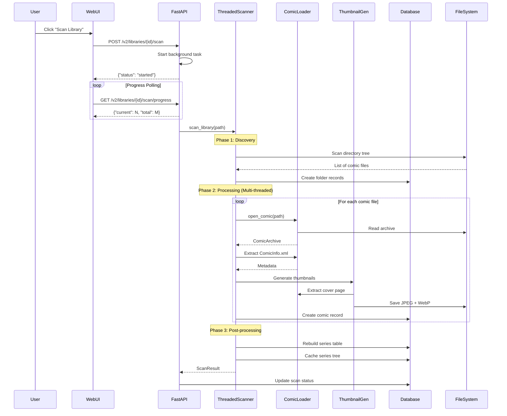
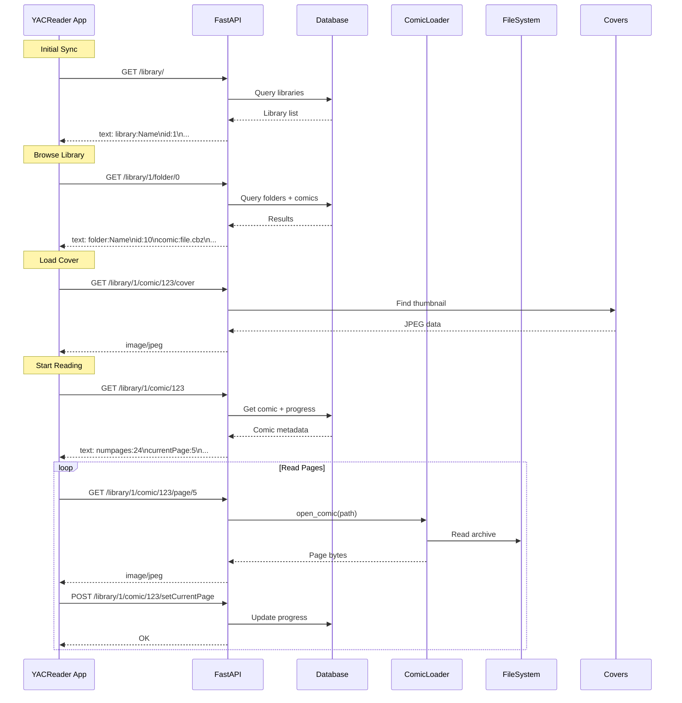
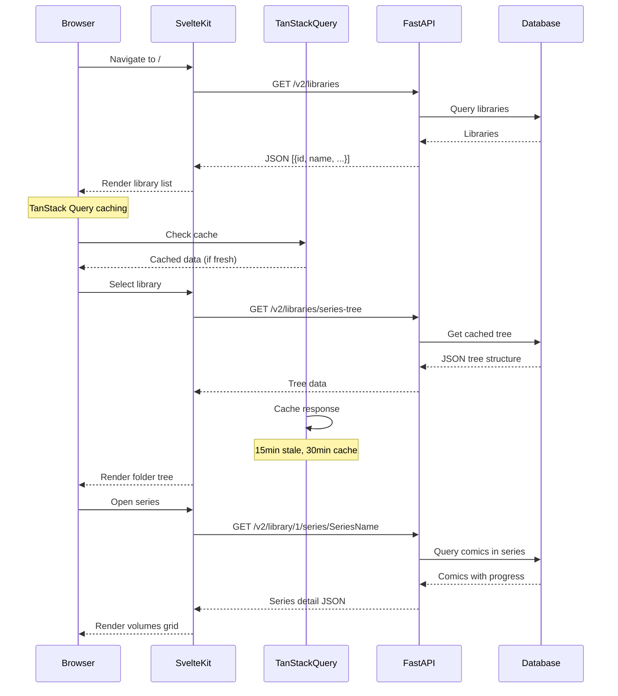
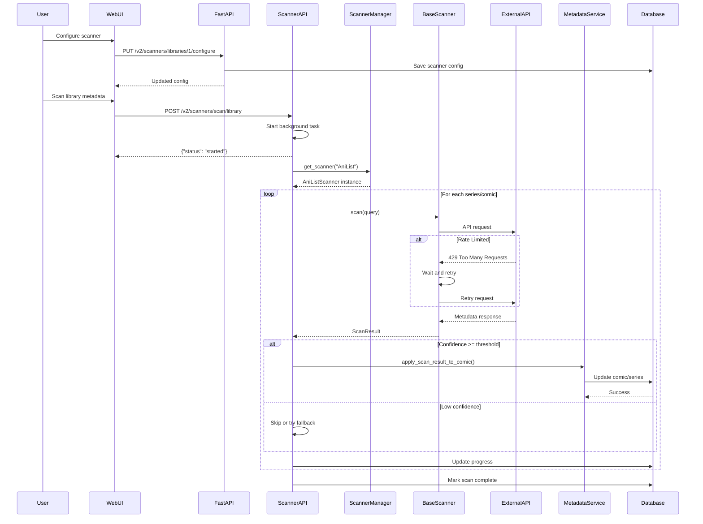
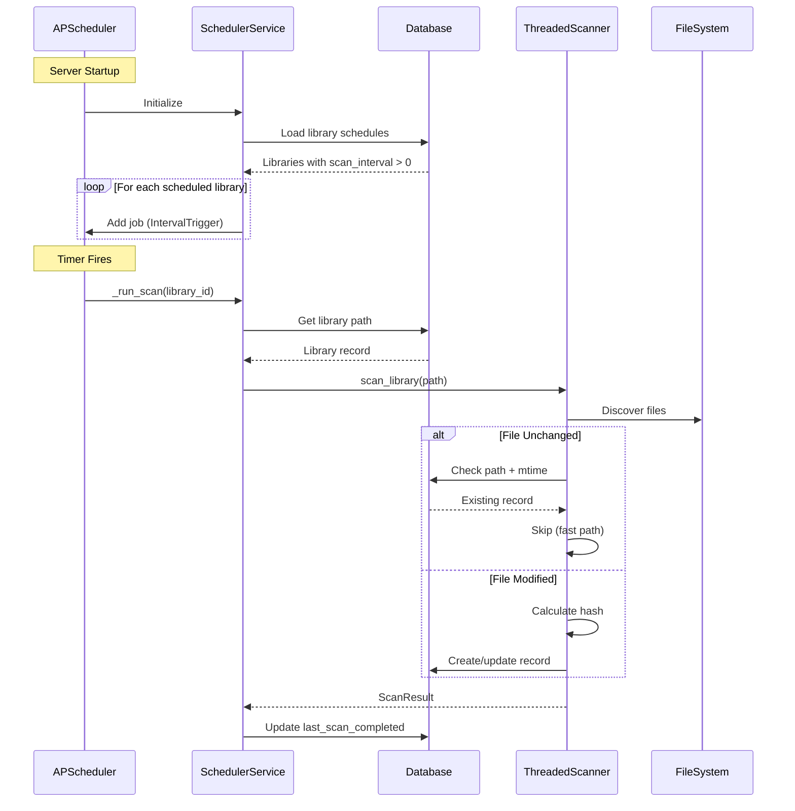
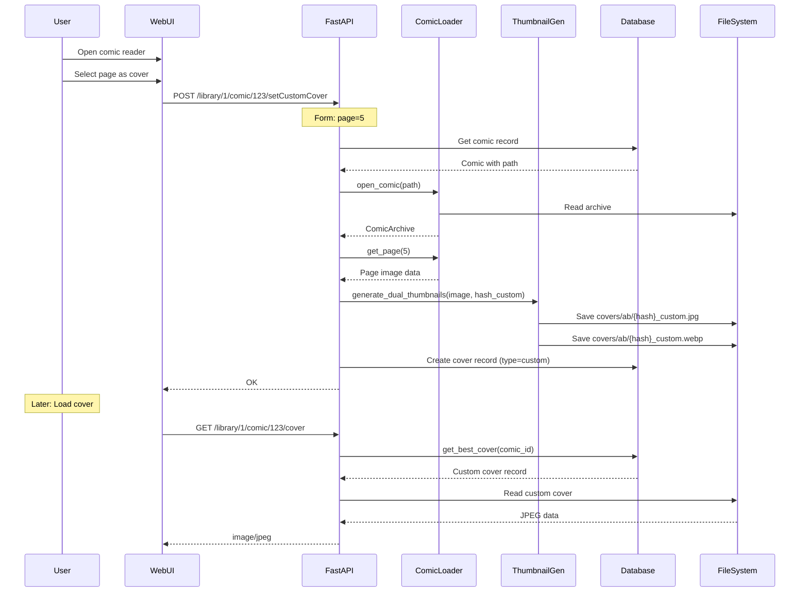
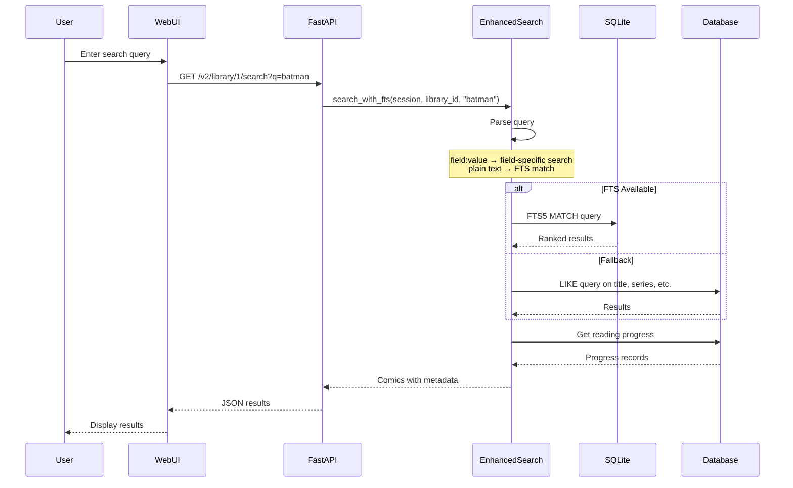
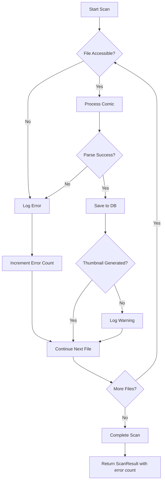

# Data Flow Documentation

## Overview

This document describes the end-to-end data flows through the Kottlib system with sequence diagrams.

---

## Flow 1: Library Scanning

The process of discovering and indexing comics in a library.



### Key Steps

1. **User Trigger**: Manual scan via Web UI or scheduled job
2. **Background Task**: Scan runs asynchronously to not block API
3. **Discovery Phase**: Fast single-threaded file enumeration
4. **Processing Phase**: Multi-threaded comic processing
5. **Post-Processing**: Series aggregation and cache building

---

## Flow 2: Mobile App Reading

YACReader mobile app reading a comic.



### Key Points

- **Plain Text Format**: Legacy API uses `\r\n` delimited text
- **Session Cookie**: `yacread_session` for user identification
- **Progress Tracking**: Page updates sent on navigation
- **Cover Caching**: 1-year cache headers for covers

---

## Flow 3: Web UI Browsing

Modern web interface browsing experience.



### Caching Strategy

- **TanStack Query**: Client-side caching
  - `staleTime`: 15 minutes
  - `cacheTime`: 30 minutes
- **HTTP Cache**: Server sets appropriate headers
- **Series Tree Cache**: Pre-computed during scans

---

## Flow 4: Metadata Scanning

Fetching metadata from external sources.



### Scanner Levels

| Level | Behavior | Example |
|-------|----------|---------|
| FILE | Scan each comic individually | nhentai (by ID) |
| SERIES | Scan unique series names | AniList, Comic Vine |

### Rate Limiting

- **AniList**: 90 requests/minute
- **MangaDex**: 5 requests/second
- **Comic Vine**: Varies by API tier

---

## Flow 5: Scheduled Scanning

Automatic periodic library scans.



### Schedule Management

- **Job ID Format**: `scan_library_{library_id}`
- **Trigger**: `IntervalTrigger(minutes=scan_interval)`
- **Persistence**: In-memory (reloaded from DB on restart)
- **Disable**: Set `scan_interval = 0`

---

## Flow 6: Cover Generation

Custom cover selection and generation.



### Cover Priority

1. **Custom Cover**: User-selected page
2. **Auto Cover**: First page extracted during scan
3. **Fallback**: Extract on-demand if missing

### Storage Structure

```
covers/
├── ab/
│   ├── abc123def456.jpg      # Auto JPEG
│   ├── abc123def456.webp     # Auto WebP
│   ├── abc123def456_custom.jpg   # Custom JPEG
│   └── abc123def456_custom.webp  # Custom WebP
└── cd/
    └── ...
```

---

## Flow 7: Search Query

Full-text search execution.



### Search Features

- **Full-Text Search**: SQLite FTS5 when available
- **Field-Specific**: `writer:Stan Lee`, `genre:action`
- **Boolean Logic**: AND, OR, NOT
- **Fallback**: LIKE queries if FTS unavailable

---

## Data Synchronization

### Reading Progress Sync

```
Mobile App → setCurrentPage → Database ← Web UI
                                ↓
                          Reading Progress Record
                                ↓
                          Continue Reading List
```

### Library State

```
File System Changes
        ↓
Scheduled/Manual Scan
        ↓
Database Records Updated
        ↓
Series Tree Cache Rebuilt
        ↓
UI Receives Fresh Data
```

---

## Error Handling Flows

### Scan Error Recovery



### API Error Responses

| Code | Scenario | User Action |
|------|----------|-------------|
| 400 | Invalid request | Check parameters |
| 404 | Resource not found | Verify ID exists |
| 409 | Scan in progress | Wait for completion |
| 500 | Server error | Check logs |
